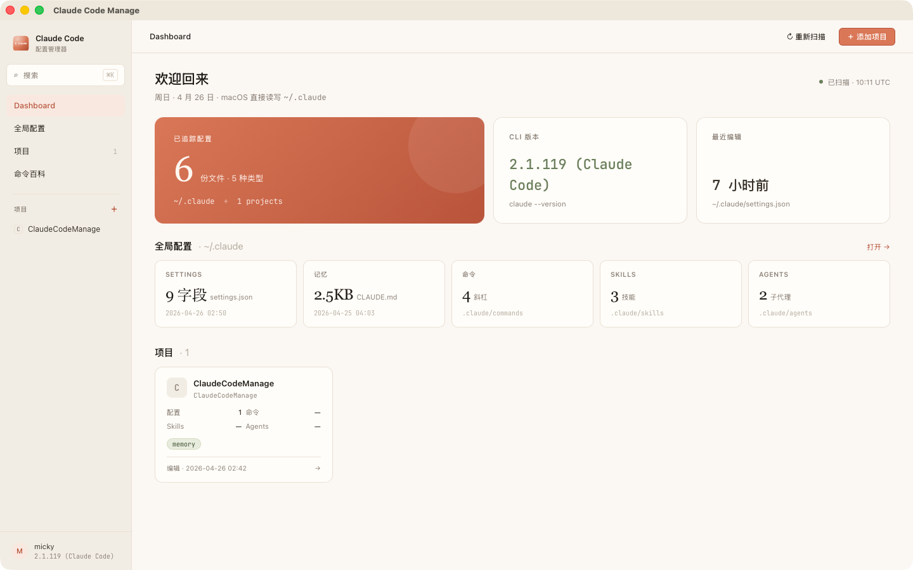
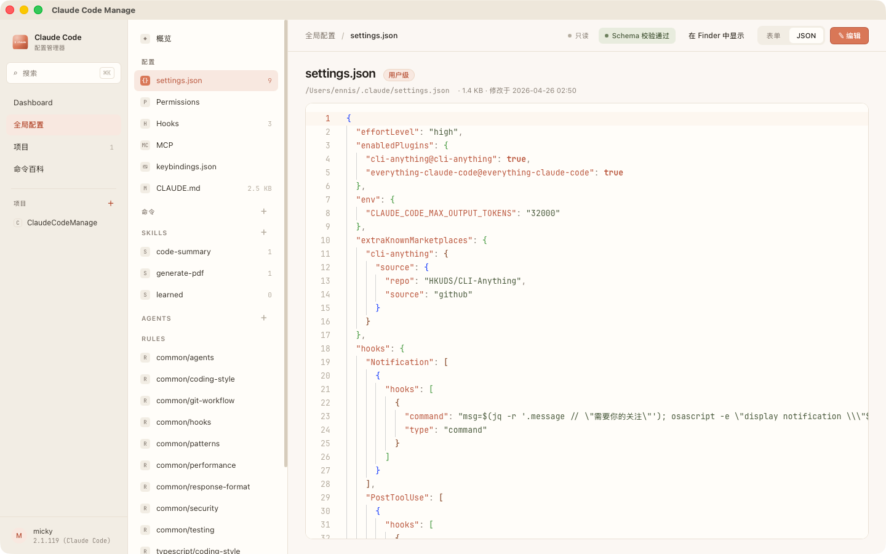
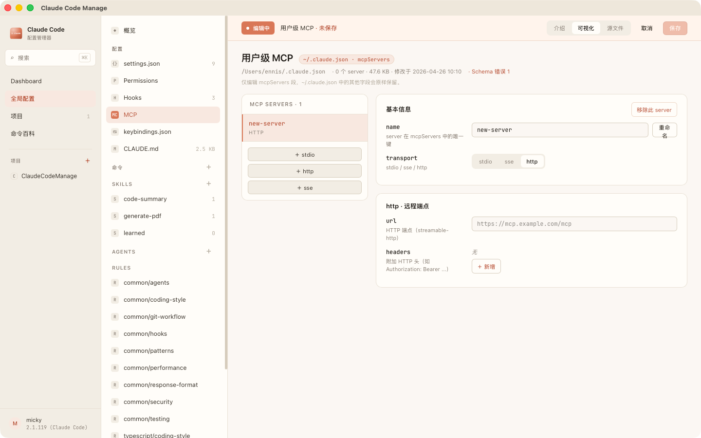

<p align="center">
  
</p>

<h1 align="center">Claude Code Manage</h1>

<p align="center">
  <strong>Claude Code 的桌面配置管理器</strong><br/>
  在一个原生 macOS 应用里查看与编辑 <code>~/.claude</code> 和各项目 <code>.claude/</code> 下的所有配置。
</p>

<p align="center">
  
  
  
  
  
</p>

---

## 为什么

Claude Code 的所有配置都是散落的文件 —— `settings.json`、`CLAUDE.md`、`keybindings.json`、`commands/`、`skills/`、`agents/`、`.mcp.json` …… 同时分布在 `~/.claude` 和**每个项目**的 `.claude/` 里。

实际使用中常遇到这些痛点：

- 改一个 hook 要打开 JSON 手写 matcher
- 看一个项目装了哪些 Skill / Agent 要逐个目录翻
- 想对照用户级和项目级 `CLAUDE.md` 要在编辑器里开两个 tab
- MCP 配置要查 transport 文档、手写 `command` / `args` / `env`
- 没有 schema 校验，写错一个 key 要等 Claude Code 启动报错才发现

**Claude Code Manage** 把这些聚合到一个 Tauri 原生应用里 —— 不上传任何配置到云端，所有读写都在本机文件系统。

## 截图

<p align="center">
  
  <br/><sub><b>Dashboard</b> — 用户级与项目级配置一站式概览</sub>
</p>

<p align="center">
  
  <br/><sub><b>settings.json</b> — Monaco 内嵌编辑 + Schema 校验 + mtime 冲突检测</sub>
</p>

<p align="center">
  
  <br/><sub><b>MCP</b> — <code>.mcp.json</code> 三视图：介绍 / 表单 / 源码</sub>
</p>

## 主要功能

| 模块 | 能力 |
|---|---|
| **统一视图** | 用户级（`~/.claude`）与项目级（`<project>/.claude`、`.mcp.json`、根 `CLAUDE.md`）同窗口对照 |
| **原生编辑** | JSON / Markdown 用 Monaco 内嵌编辑；Markdown 支持「编辑 / 预览 / 分屏」三态 |
| **Schema 校验** | `settings.json` / `.mcp.json` 写入前做形状校验，未通过禁用保存 |
| **可视化 MCP** | 表单视图覆盖 `stdio` / `sse` / `http` 三种 transport，无需手写 JSON |
| **命令百科** | 内置斜杠命令 + `claude <subcmd>` CLI 清单，本地离线 |
| **安全写盘** | 原子 `rename` + 基于 mtime 的外部修改检测 + 写入前自动备份到 `~/.claude/.backups/` |
| **文件监听** | `notify` 监听用户目录与项目目录，外部用 vim/IDE 改完立即重扫 |
| **全局搜索** | ⌘K 命令面板跨所有配置文件做文件名 + 内容搜索 |

## 快速开始

依赖：**macOS 12+ · Node 18+ · [bun](https://bun.sh) · Rust toolchain（cargo）**

```bash
git clone https://github.com/<your-name>/ClaudeCodeManage.git
cd ClaudeCodeManage

bun install              # 安装前端依赖
bun run tauri dev        # 启动开发模式（Vite + Tauri）
bun run tauri build      # 打包发行 .app / .dmg
```

打包产物位置：

```
src-tauri/target/release/bundle/macos/Claude Code Manage.app
src-tauri/target/release/bundle/dmg/Claude Code Manage_<version>_aarch64.dmg
```

## 技术栈

| 层 | 技术 |
|---|---|
| 桌面壳 | Tauri 2 |
| 前端 | React 19 · TypeScript 5.8 · Vite 7 |
| 状态 | Zustand 5（含 `persist` 中间件） |
| 样式 | TailwindCSS v4 · 内联 CSS 变量（Anthropic 主题） |
| 编辑器 | `@monaco-editor/react` |
| Markdown | `react-markdown` + `remark-gfm` |
| 后端 | Rust · `serde` · `chrono` · `walkdir` · `notify` |

## 目录结构

```
ClaudeCodeManage/
├── src/                    前端（React 19 + TS 5.8 + Vite 7）
│   ├── App.tsx             路由分发，初始化调用 scanAll
│   ├── components/         Rail / InnerSidebar / Topbar / CodeEditor / Dialog / Toast
│   ├── screens/            Dashboard / GlobalConfig / Settings / ProjectDetail / Catalog / McpEditor ...
│   ├── store/              app-store（UI）/ config-store（后端数据）
│   ├── lib/                fs-bridge / settings-schema / mcp-schema / entry-templates
│   ├── data/               commands.ts 命令百科
│   └── index.css           主题变量
├── src-tauri/              后端（Rust，crate = claude_code_manage）
│   ├── src/
│   │   ├── lib.rs          Tauri commands 注册
│   │   ├── paths.rs        ~/.claude、app data 路径解析
│   │   ├── model/mod.rs    序列化结构
│   │   └── services/       scanner / project_list / fs_write / search / watcher
│   ├── capabilities/       Tauri 权限
│   └── tauri.conf.json
├── public/                 应用图标等静态资源
├── LICENSE                 MIT
└── package.json
```

## 路径约定

- **用户级配置**：`~/.claude/`（`settings.json`、`keybindings.json`、`CLAUDE.md`、`commands/`、`skills/`、`agents/`）
- **项目注册表**：`~/Library/Application Support/claude-code-manage/projects.json`
- **项目级配置**：`<project>/.claude/`，`CLAUDE.md` 优先项目根、回退 `.claude/CLAUDE.md`
- **MCP**：`<project>/.mcp.json`
- **备份**：写入前自动落到 `~/.claude/.backups/<timestamp>-<filename>.bak`

## Tauri 命令一览

| 命令 | 用途 |
|---|---|
| `scan_all` | 全量扫描，返回 `ClaudeConfigSnapshot` |
| `get_claude_version` | 调 `claude --version` |
| `list_projects` / `add_project` / `remove_project` | 项目注册表 CRUD |
| `read_text_file` / `write_text_file` / `write_json_file` | 文件读写（含 mtime 冲突检测 + 备份） |
| `create_file` / `create_dir` / `delete_path` | 基础文件操作 |
| `detect_external_change` | 基于 mtime 的冲突检测 |
| `list_skill_files` | Skill 目录递归列表 |
| `search_all` | 全局文件名 + 内容搜索（命令面板） |
| `reveal_in_finder` | 系统 `open -R <path>` |
| `restart_watcher` | 重启 `notify` 监听，事件从 `config-changed` 发送 |

## 安全说明

- 所有读写仅在本机文件系统，**不联网传输**任何配置内容
- 删除操作会先把目标拷贝到 `~/.claude/.backups/`，再实际删除
- JSON 写入前做 schema 校验，避免写出错配置导致 Claude Code 启动失败
- 编辑→保存全程基于 mtime 做冲突检测，外部修改时弹窗让用户选择覆盖或取消

## 平台支持

目前仅 **macOS**。`paths.rs` 依赖 `$HOME` 环境变量，Windows / Linux 适配在路线图中。

## 路线图

- [ ] Windows / Linux 适配（`paths.rs` 解耦 `$HOME` → 用 `dirs` crate）
- [ ] Skills / Agents 的可视化编辑（当前仅纯文本）
- [ ] 配置 diff 对比视图（`react-diff-viewer-continued` 已装，待接入）
- [ ] 常用 hook 模板一键创建
- [ ] 项目级 vs 用户级配置的差异高亮

## 贡献

欢迎 issue / PR。提交 PR 前请确保：

- `bun run build` 通过
- `cd src-tauri && cargo check` 通过
- 仅改动需要的文件，遵循根目录 `CLAUDE.md` 中的代码风格

## 许可

[MIT](./LICENSE) © 2026 Ennis
